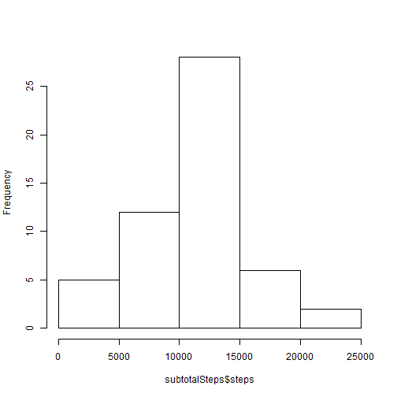
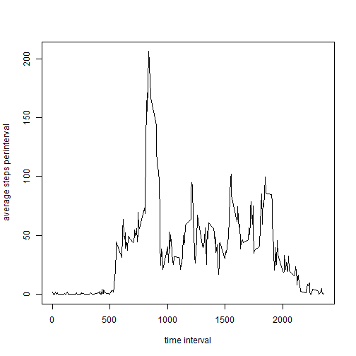
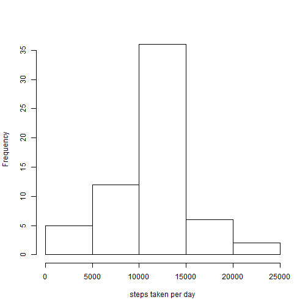

## Loading and preprocessing the data

```r
data<-read.csv("./activity.csv",stringsAsFactors=FALSE)
data$date=as.Date(data$date,"%Y-%m-%d")
```

## What is mean total number of steps taken per day?
Plotting the histogram of total steps taken per day


```r
data1<-subset(data,!is.na(data$steps))
subtotalSteps<-aggregate(steps~date,data1,sum)
hist(subtotalSteps$steps, main="")
```

 


```r
meanSteps<-mean(subtotalSteps$steps)
medianSteps<-median(subtotalSteps$steps)
```
- mean of the total steps taken per day is 1.0766189 &times; 10<sup>4</sup>
- median of the total steps taken per day is 10765

##What is the average daily activity pattern?
Plotting average steps per interval across all days

```r
intervalSteps<-aggregate(steps~interval,data1,mean)
head(intervalSteps)
```

```
##   interval     steps
## 1        0 1.7169811
## 2        5 0.3396226
## 3       10 0.1320755
## 4       15 0.1509434
## 5       20 0.0754717
## 6       25 2.0943396
```

```r
plot(intervalSteps$interval,intervalSteps$steps,type="l",xlab="time interval",ylab="average steps perinterval")
```

 

```r
maxInterval<-intervalSteps$interval[intervalSteps$steps==max(intervalSteps$steps)]
```
The interval with max no of steps on average is 835

##Imputing missing values

```r
missingRows<-nrow(data)-nrow(na.omit(data))
```
No of rows with missing values is 2304

Filling the missing values

```r
## missed values are filled with average no of steps per interval taken across ##all days.
datafill<-data
for (i in 1:nrow(datafill)) {
  if(is.na(datafill[i,1])) {
    
    datafill[i,1]<-intervalSteps$steps[intervalSteps$interval==datafill[i,3]]
    }
  }
```
Histogram of Steps taken per day

```r
stepsPerDay<-aggregate(steps~date,datafill,sum)
hist(stepsPerDay$steps,xlab="steps taken per day",main="")
```

 

```r
meanStepsPerDay<-mean(stepsPerDay$steps)
medianStepsPerDay<-median(stepsPerDay$steps)
```
- Mean of steps per day with the missing values flled in is 1.0766189 &times; 10<sup>4</sup>
- Median of steps per day with the missing values flled in is 1.0766189 &times; 10<sup>4</sup>

Compare this with the Mean and median with out filling in the missing values

- mean  1.0766189 &times; 10<sup>4</sup>
- median  10765

##Are there differences in activity patterns between weekdays and weekends?
Plotting average steps per interval


```r
datafill$weekday<-weekdays(datafill$date)
datafill$dayIndicator<-datafill$weekday
for(i in 1:nrow(datafill)) {
  if(datafill[i,4]=="Sunday"|datafill[i,4]=="Saturday") {
    datafill[i,5]<-"weekend"
    }
  else {datafill[i,5]="weekday"}
  }

library(lattice)
xyplot(steps~interval|dayIndicator,daywiseSteps,layout=c(1,2),type='l')
```

 
